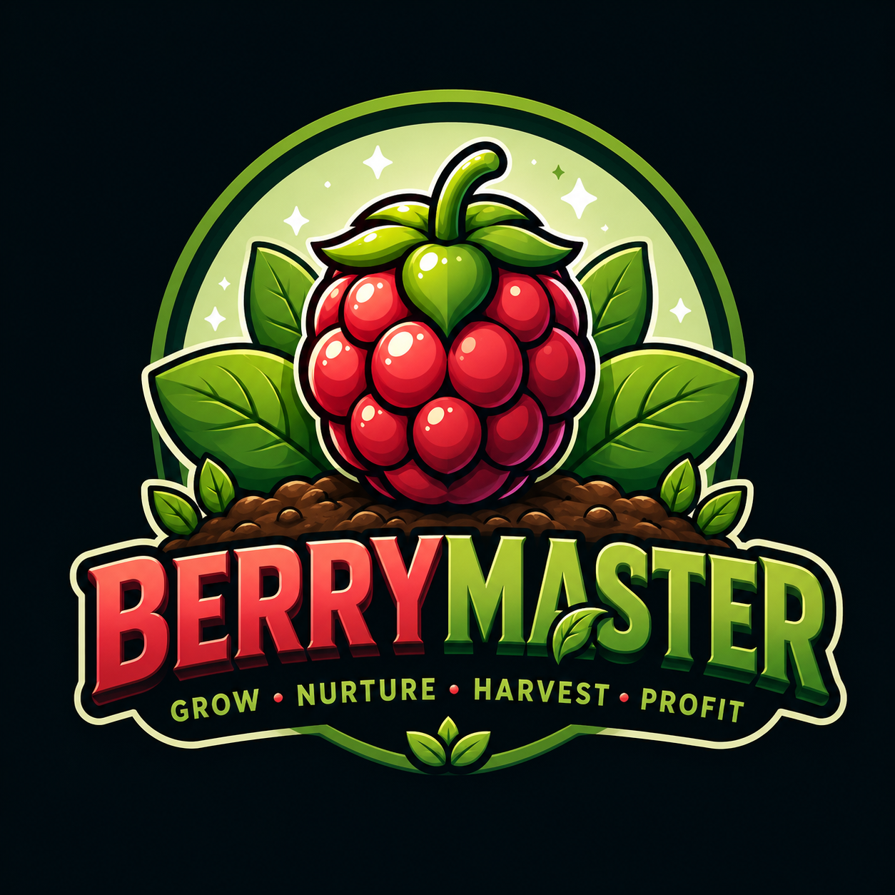

# 🍒 BerryMaster — PokeMMO Farming Companion

**The Ultimate Offline-First, Precision Farming & Automation Companion for PokeMMO.**

---

### 📥 1-Click Direct Downloads

| Platform | Download Link | Type |
| :--- | :--- | :--- |
| 📱 **Android** | [**Download Android APK (`.apk`)**](https://github.com/abhijeet-mishra34/BerryMaster/releases/latest/download/BerryMaster-universal.apk) | Universal Signed APK (All Android Devices) |
| 💻 **Windows PC** | [**Download Windows Setup (`.exe`)**](https://github.com/abhijeet-mishra34/BerryMaster/releases/latest/download/BerryMaster-Windows-Setup.exe) | Native Windows Desktop App with Tray Mode |

---

## ✨ Key Features

* 👥 **Multi-Character Farming**: Manage individual characters, isolated inventories, and specific farming plots across regions (Unova, Hoenn, Sinnoh, Kanto).
* ⏱️ **Precision Watering & Harvest Alarms**: Live background timers with native OS desktop & Android push notifications.
* 🌿 **Self-Sustaining Leppa Calculator**: Real-time seed yield analytics to calculate profits, re-planting costs, and net Pokédollars.
* 📊 **Interactive Analytics & Yield Trends**: Built-in production telemetry, harvest schedules, and profit forecasting.
* 💎 **Clean, Dark Jewel UI**: Designed with Obsidian Slate (`#0f172a`), Ruby Berry accents (`#e11d48`), and full Light/Dark mode themes.
* 🔄 **Built-in GitHub Auto-Updater**: In-app one-click update detector that checks GitHub Releases for new builds.

---

## 🛠️ Built With

* **Frontend**: React 19, TypeScript, Tailwind CSS, Lucide Icons, Recharts
* **Native Desktop & Mobile Engine**: Tauri v2, Rust
* **Packaging & CI/CD**: GitHub Actions, Gradle, `apksigner`

---

## ⚖️ Legal & Privacy

* **License**: Distributed under the [MIT License](LICENSE). See `LICENSE` for more information.
* **Disclaimers & Fair Use**: BerryMaster is an unofficial, non-commercial fan companion tool and is not affiliated with Nintendo, Game Freak, or PokeMMO. Read our full [Legal Notice & Disclaimers](DISCLAIMER.md).
* **Privacy**: Offline-first architecture. We do not track, collect, or upload your game credentials or farming data. Read our full [Privacy Policy](PRIVACY.md).

---

Developed with ❤️ by **Abhijeet Mishra**.